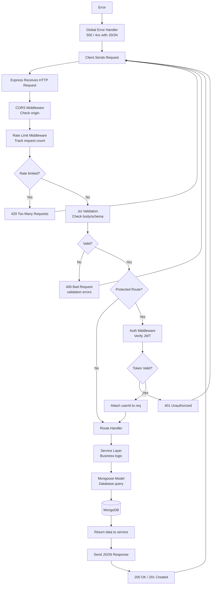
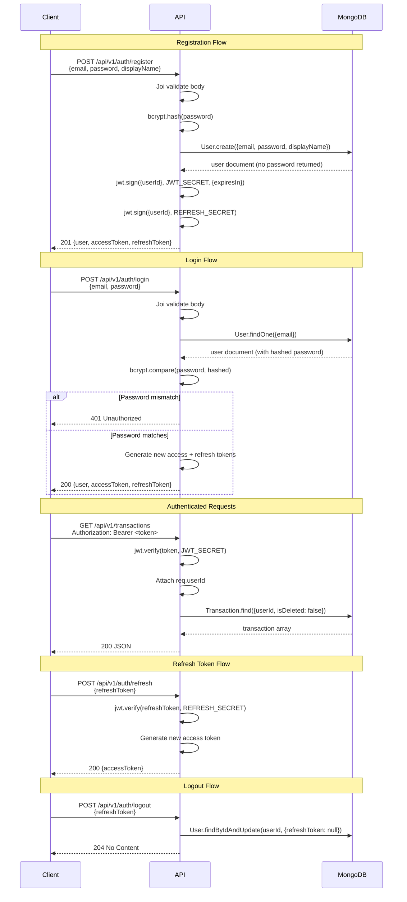
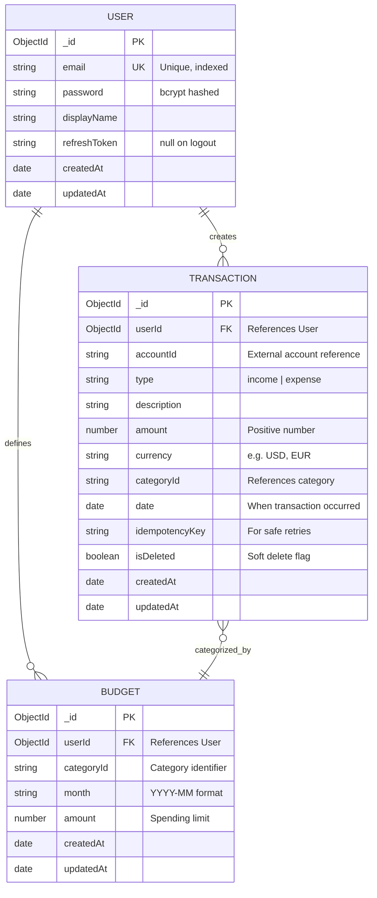
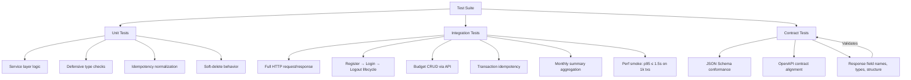
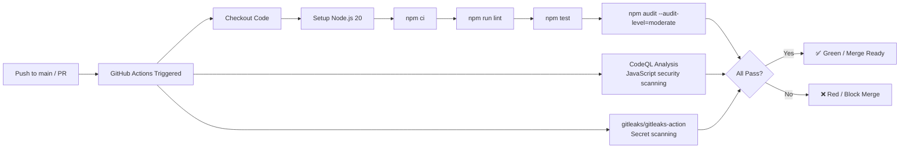

# Personal Budget

<div align="center">


**A production-ready REST API for personal budget management — track income, expenses, budgets, and monthly summaries with JWT authentication, Joi validation, and rate limiting.**

[Repository](https://github.com/Colin-Stark/personal_budget) · [Report a Bug](https://github.com/Colin-Stark/personal_budget/issues)

</div>

---

## Table of Contents

1. [Overview](#overview)
2. [Features](#features)
3. [Tech Stack](#tech-stack)
4. [Architecture](#architecture)
5. [Request Lifecycle](#request-lifecycle)
6. [Authentication Flow](#authentication-flow)
7. [Data Model](#data-model)
8. [Getting Started](#getting-started)
9. [Environment Variables](#environment-variables)
10. [Project Structure](#project-structure)
11. [API Reference](#api-reference)
12. [Example Requests](#example-requests)
13. [Validation & Rate Limiting](#validation--rate-limiting)
14. [Testing](#testing)
15. [CI/CD](#cicd)
16. [Security](#security)
17. [Contributing](#contributing)
18. [Roadmap & Status](#roadmap--status)
19. [License](#license)

---

## Overview

**Personal Budget** is a RESTful API designed to help users manage their personal finances. It provides authenticated access to track income and expense transactions, set category-based budget limits, and generate monthly financial summaries. The API is built with Express.js and MongoDB, following a clean layered architecture with JWT authentication, Joi input validation, rate limiting, and comprehensive testing.

> **Built with ❤️ by [COLLINS OLOKPEDJE](https://github.com/Colin-Stark)**

Use this API as the backend for a mobile app, a web dashboard, or any financial tool that needs structured budget data.

---

## Features

### Core Capabilities

| Feature | Description |
|---------|-------------|
| **User Auth** | Registration, login, password hashing (bcrypt), JWT access + refresh tokens, logout |
| **Transactions** | Full CRUD for income/expenses; soft-delete support; idempotency-safe creation |
| **Budgets** | Create per-category spending limits with monthly periods; upsert semantics |
| **Monthly Summaries** | Aggregated income/expense totals, per-category breakdowns, budget adherence percentages |
| **Input Validation** | Joi schemas on every endpoint — email format, password min-length, amount > 0, date ISO format |
| **Rate Limiting** | Auth routes: 10 req/60s; Login: 10 req/15min; API routes: 100 req/15min |
| **CORS** | Configurable allowed origins for frontend integration |
| **Error Handling** | Centralized middleware with consistent JSON error responses |

### Developer Experience

- **CI/CD** — GitHub Actions: lint, test, npm audit, gitleaks secret scan, CodeQL analysis
- **Dependabot** — Automated dependency patch updates
- **Contract Tests** — OpenAPI-aligned response schema validation (Ajv)
- **In-Memory DB Testing** — Tests run via `mongodb-memory-server` fallback / live MongoDB URI
- **Linting** — ESLint + Prettier for consistent code style
- **Spec-Driven** — SpecKit methodology with constitution, spec, plan, and task templates

---

## Tech Stack

| Layer | Technology |
|-------|-----------|
| **Runtime** | Node.js 18+ |
| **Framework** | Express.js v5 |
| **Database** | MongoDB via Mongoose ODM |
| **Authentication** | JWT (access + refresh) + bcrypt |
| **Validation** | Joi |
| **Rate Limiting** | express-rate-limit |
| **CORS** | cors |
| **Environment** | dotenv |
| **Testing** | Jest + Supertest + mongodb-memory-server |
| **Contract Validation** | Ajv (JSON Schema) |
| **CI** | GitHub Actions + gitleaks + CodeQL |

---

## Architecture

### High-Level Component Diagram

```
+------------------------------------------------------------------+
|                    Client Applications                            |
|         (Mobile App, Web Frontend, CLI Tool)                      |
+------------------------------+-----------------------------------+
                               |
                               |  HTTPS / REST
                               v
+------------------------------------------------------------------+
|                     Express.js Server                             |
|                                                                   |
|  ┌────────────┐   ┌───────────────┐   ┌───────────────────────┐   |
|  │   Routes   │   │  Middleware   │   │   Error Handlers      │   |
|  │   Layer    │──▶│   Layer       │──▶│      Layer           │   | 
|  └────────────┘   └───────────────┘   └───────────────────────┘   |
|                       │         │                    │            |
|                       ▼         ▼                    ▼            |
|              ┌────────────────────────────────────────────────┐   |
|              │           Service Layer                        │   |
|              │   ┌────────────┐  ┌──────────────┐             │   |
|              │   │ userSvc    │  │transactionSvc│  summarySvc │   |
|              │   └─────┬──────┘  └──────┬───────┘             │   |
|              └─────────│────────────────│──────────────────   ┘   |
|                        │                │                         |
|              ┌─────────┴────────────────┴──────────────────┐      |
|              │          Mongoose Models                    │      |
|              │   ┌─────────┐  ┌──────────────┐             │      |
|              │   │   User  │  │ Transaction  │   Budget    │      |
|              │   └────┬────┘  └──────┬───────┘             │      |
|              └────────│──────────────│─────────────────────┘      |
|                       │              │                            |
|                       v              v                            |
|              +----------------------------------------------+     |
|              |         Mongoose ODM ──────────▶ MongoDB     |     |
|              +----------------------------------------------+     |
+------------------------------------------------------------------+
```

### Layer Responsibilities

```
┌───────────────────────────────────────────────────────────────────┐
│                    API LAYER RESPONSIBILITIES                     │
├───────────────────────────────────────────────────────────────────┤
│                                                                   │
│  1. ROUTE LAYER                                                   │
│     • Defines URL paths and HTTP methods                          │
│     • Parses JSON request bodies                                  │
│     • Delegates to service functions                              │
│     • Returns HTTP status codes and JSON responses                │
│                                                                   │
│  2. MIDDLEWARE LAYER                                              │
│     • CORS configuration                                          │
│     • Express-rate-limit on all /api/v1 routes                    │
│     • Joi body validation per-endpoint                            │
│     • JWT verification on protected routes                        │
│     • Attaches req.userId from decoded token                      │
│     • Global error handler (centralized try/catch)                │
│                                                                   │
│  3. SERVICE LAYER                                                 │
│     • Business logic (no HTTP concerns)                           │
│     • Password hashing via bcrypt                                 │
│     • JWT token generation / verification                         │
│     • Idempotency key normalization                               │
│     • Aggregate queries for monthly summaries                     │
│     • Defensive type-checking before DB calls                     │
│                                                                   │
│  4. MODEL LAYER                                                   │
│     • Mongoose schema definitions                                 │
│     • Field validation rules                                      │
│     • Database indexes                                            │
│     • Mongoose model methods                                      │
│     • Soft-delete support (isDeleted flag)                        │
│                                                                   │
└───────────────────────────────────────────────────────────────────┘
```

---

## Request Lifecycle



---

## Authentication Flow



---

## Data Model



---

## Getting Started

### Prerequisites

| Tool | Minimum Version | Install |
|------|----------------|---------|
| Node.js | 18.x LTS | [nodejs.org](https://nodejs.org/) |
| npm | 9.x | Bundled with Node.js |
| MongoDB | 6.x | [mongodb.com](https://www.mongodb.com/try/download/community) |
| Git | latest | [git-scm.com](https://git-scm.com/) |

### Installation

**1. Clone the repository**

```bash
git clone https://github.com/Colin-Stark/personal_budget.git
cd personal_budget
```

**2. Install dependencies**

```bash
npm install
```

**3. Create a `.env` file** in the project root:

```env
# Server Configuration
NODE_ENV=development
PORT=3000

# Database
MONGO_URI=mongodb://localhost:27017/personal_budget

# JWT Authentication
JWT_SECRET=generate_a_secure_32_plus_character_secret_here
JWT_EXPIRES_IN=7d
REFRESH_TOKEN_SECRET=generate_another_secure_secret_here

# CORS
ALLOWED_ORIGINS=http://localhost:3001,http://localhost:5173
```

> ⚠️ **Security:** `.env` is in `.gitignore` — never commit secrets to version control. Use strong, random values for JWT secrets (e.g., `openssl rand -hex 32`).

**4. Start MongoDB locally (if not using Atlas)**

```bash
# macOS (Homebrew)
brew services start mongodb-community

# Linux
sudo systemctl start mongod

# Windows
net start MongoDB

# Verify connection
mongosh --eval "db.adminCommand('ping')"
# Expected: { ok: 1 }
```

**5. Start the server**

```bash
# Development
node index.js

# Output:
# 🚀 Personal Budget API running on port 3000
# 📊 Environment: development
# 🗄️  Database: Connected
```

The API will be available at `http://localhost:3000`.

---

## Environment Variables

| Variable | Required | Default | Description |
|----------|:--------:|---------|-------------|
| `NODE_ENV` | No | `development` | Environment mode: `development`, `production`, `test` |
| `PORT` | No | `3000` | Port the server listens on |
| `MONGO_URI` | Yes | — | MongoDB connection string (`mongodb://localhost:27017/personal_budget` or Atlas URI) |
| `JWT_SECRET` | Yes | — | Secret key for signing access tokens (min 32 characters recommended) |
| `JWT_EXPIRES_IN` | No | `7d` | Access token expiry (e.g., `1h`, `7d`, `15m`) |
| `REFRESH_TOKEN_SECRET` | Yes | — | Secret key for signing refresh tokens |
| `ALLOWED_ORIGINS` | No | `*` | Comma-separated list of allowed CORS origins |

> 💡 **Tip:** Generate secrets with `openssl rand -base64 32` or `node -e "console.log(require('crypto').randomBytes(32).toString('hex'))"`

---

## Project Structure

```
personal_budget/
├── index.js                          # Entry point — server, middleware, routes
├── package.json                      # Dependencies & metadata
├── package-lock.json                 # Locked dependency tree
├── .gitignore                        # Excludes node_modules/ & .env
│
├── .vscode/
│   └── settings.json                 # Workspace settings (SpecKit prompt recommendations)
│
├── .specify/                         # SpecKit methodology artifacts
│   ├── memory/
│   │   └── constitution.md            # Project constitution v1.0.0
│   ├── scripts/
│   │   └── powershell/               # Automation scripts for spec workflow
│   │       ├── check-prerequisites.ps1
│   │       ├── common.ps1
│   │       ├── create-new-feature.ps1
│   │       ├── setup-plan.ps1
│   │       └── update-agent-context.ps1
│   └── templates/                    # Document templates
│       ├── agent-file-template.md
│       ├── checklist-template.md
│       ├── constitution-template.md
│       ├── plan-template.md
│       ├── spec-template.md
│       └── tasks-template.md
│
└── .github/
    ├── agents/                       # SpecKit AI agent definitions
    │   ├── speckit.analyze.agent.md
    │   ├── speckit.checklist.agent.md
    │   ├── speckit.clarify.agent.md
    │   ├── speckit.constitution.agent.md
    │   ├── speckit.implement.agent.md
    │   ├── speckit.plan.agent.md
    │   ├── speckit.specify.agent.md
    │   ├── speckit.tasks.agent.md
    │   └── speckit.taskstoissues.agent.md
    └── prompts/                      # SpecKit prompt templates
        ├── speckit.analyze.prompt.md
        ├── speckit.checklist.prompt.md
        ├── speckit.clarify.prompt.md
        ├── speckit.constitution.prompt.md
        ├── speckit.implement.prompt.md
        ├── speckit.plan.prompt.md
        ├── speckit.specify.prompt.md
        ├── speckit.tasks.prompt.md
        └── speckit.taskstoissues.prompt.md
```

> 📁 The application source code (routes, services, models, middleware, tests) lives on the `001-budget-api-hardening-tests` feature branch.

---

## API Reference

Base URL: `http://localhost:3000/api/v1`

All endpoints return JSON. Protected routes require `Authorization: Bearer <accessToken>` header.

### Authentication

| Method | Endpoint | Auth | Description |
|--------|----------|:----:|-------------|
| `POST` | `/api/v1/auth/register` | ❌ | Create a new user account |
| `POST` | `/api/v1/auth/login` | ❌ | Log in and receive JWT tokens |
| `POST` | `/api/v1/auth/refresh` | ❌ | Refresh an expired access token |
| `POST` | `/api/v1/auth/logout` | ❌ | Invalidate refresh token |

### Transactions

| Method | Endpoint | Auth | Description |
|--------|----------|:----:|-------------|
| `GET` | `/api/v1/transactions` | ✅ | List all user's transactions |
| `POST` | `/api/v1/transactions` | ✅ | Create a new transaction |
| `GET` | `/api/v1/transactions/:id` | ✅ | Get a single transaction |
| `PUT` | `/api/v1/transactions/:id` | ✅ | Update a transaction |
| `DELETE` | `/api/v1/transactions/:id` | ✅ | Soft-delete a transaction |

### Budgets

| Method | Endpoint | Auth | Description |
|--------|----------|:----:|-------------|
| `GET` | `/api/v1/budgets` | ✅ | List all user's budgets |
| `POST` | `/api/v1/budgets` | ✅ | Create or update a budget (upsert) |
| `GET` | `/api/v1/budgets/:id` | ✅ | Get a single budget |
| `DELETE` | `/api/v1/budgets/:id` | ✅ | Delete a budget |

### Summaries

| Method | Endpoint | Auth | Description |
|--------|----------|:----:|-------------|
| `GET` | `/api/v1/summaries/monthly` | ✅ | Monthly financial summary with category breakdowns and budget adherence |

---

## Example Requests

### Register a New User

```bash
curl -X POST http://localhost:3000/api/v1/auth/register \
  -H "Content-Type: application/json" \
  -d '{
    "email": "alex@example.com",
    "password": "SecurePass123!",
    "displayName": "Alex Johnson"
  }'
```

**Response `201 Created`:**

```json
{
  "user": {
    "id": "65a1b2c3d4e5f6789abc0def",
    "email": "alex@example.com",
    "displayName": "Alex Johnson"
  },
  "accessToken": "eyJhbGciOiJIUzI1NiIsInR5cCI6IkpXVCJ9...",
  "refreshToken": "eyJhbGciOiJIUzI1NiIsInR5cCI6IkpXVCJ9..."
}
```

### Log In

```bash
curl -X POST http://localhost:3000/api/v1/auth/login \
  -H "Content-Type: application/json" \
  -d '{
    "email": "alex@example.com",
    "password": "SecurePass123!"
  }'
```

**Response `200 OK`:**

```json
{
  "user": { "id": "...", "email": "alex@example.com", "displayName": "Alex Johnson" },
  "accessToken": "eyJ...",
  "refreshToken": "eyJ..."
}
```

### Create a Transaction (Protected)

```bash
curl -X POST http://localhost:3000/api/v1/transactions \
  -H "Content-Type: application/json" \
  -H "Authorization: Bearer eyJ..." \
  -d '{
    "accountId": "acc_12345",
    "type": "expense",
    "description": "Weekly groceries",
    "amount": 72.50,
    "currency": "USD",
    "categoryId": "cat_groceries",
    "date": "2026-05-28T10:00:00.000Z",
    "idempotencyKey": "txn_20260528_001"
  }'
```

> 💡 **Idempotency:** Pass the same `idempotencyKey` on retry — the API returns the same transaction instead of creating a duplicate.

### Create a Budget (Protected)

```bash
curl -X POST http://localhost:3000/api/v1/budgets \
  -H "Content-Type: application/json" \
  -H "Authorization: Bearer eyJ..." \
  -d '{
    "categoryId": "cat_groceries",
    "month": "2026-05",
    "amount": 400.00
  }'
```

> 💡 **Upsert behavior:** Calling `POST /api/v1/budgets` with the same `categoryId` + `month` updates the existing budget instead of creating a duplicate.

### Get Monthly Summary (Protected)

```bash
curl -X GET "http://localhost:3000/api/v1/summaries/monthly?year=2026&month=05" \
  -H "Authorization: Bearer eyJ..."
```

**Response `200 OK`:**

```json
[
  {
    "month": "2026-05",
    "income": 3200.00,
    "expenses": 1845.50,
    "netSavings": 1354.50,
    "byCategory": [
      {
        "categoryId": "cat_groceries",
        "total": 412.30,
        "budgetLimit": 400.00,
        "adherencePercentage": 82.46
      },
      {
        "categoryId": "cat_transport",
        "total": 180.00,
        "budgetLimit": 200.00,
        "adherencePercentage": 90.00
      },
      {
        "categoryId": "cat_entertainment",
        "total": 340.00,
        "budgetLimit": 150.00,
        "adherencePercentage": 45.12
      }
    ]
  }
]
```

> 📊 **Adherence %** = `(totalSpent / budgetLimit) * 100`. Higher = more spent. Values over 100% mean the budget was exceeded.

---

## Validation & Rate Limiting

### Joi Validation Schemas

Every endpoint validates its request body against a Joi schema:

```mermaid
graph LR
    A[Incoming Request] --> B[Joi Schema Check]
    B --> C{Passes?}
    C -->|No| D[400 Bad Request<br/>{errors: [validation messages]}]
    C -->|Yes| E[Continue to handler]

    subgraph "Key Validation Rules"
        F[Auth: email format, password ≥ 6 chars]
        G[Transactions: amount > 0, ISO date, positive currency]
        H[Budgets: YYYY-MM month pattern, amount > 0]
        I[Refresh: refreshToken required string]
    end
```

### Rate Limits

```
┌─────────────────────────────────────────────────────────┐
│  ROUTE GROUP          │  LIMIT          │  WINDOW       │
├───────────────────────┼─────────────────┼───────────────┤
│  Auth (all routes)    │  10 requests    │  60 seconds   │
│  /auth/login          │  10 requests    │  15 minutes   │
│  Transactions         │  100 requests   │  15 minutes   │
│  Budgets              │  100 requests   │  15 minutes   │
│  Summaries            │  100 requests   │  15 minutes   │
└───────────────────────┴─────────────────┴───────────────┘

Response headers on every request:
  X-RateLimit-Limit: 10
  X-RateLimit-Remaining: 7
  X-RateLimit-Reset: 1717000000
  Retry-After: 45        (only on 429 response)
```

---

## Testing

```bash
# Run all tests
npm test

# Run a specific test suite
npx jest --testPathPattern=auth

# Run with verbose output
npx jest --verbose
```

### Test Structure

```
tests/
├── setupEnv.js                    # Injects JWT_SECRET & MONGO_URI for test env
├── helpers/
│   └── mongo.js                   # Custom mongoose connect/disconnect helper
│
├── unit/
│   └── services/
│       ├── authService.test.js    # Register, login, token rotation, logout
│       ├── budgetService.test.js  # Upsert, defensive type checks, delete
│       └── transactionService.test.js  # Idempotency, soft-delete, trim normalization
│
├── integration/
│   ├── auth.test.js               # Full register→login→refresh→logout flow
│   ├── budgets.test.js            # Create & list budgets via HTTP
│   ├── transactions.test.js       # Idempotent creation, soft-delete via HTTP
│   └── summaries.test.js          # Monthly summary endpoint + perf smoke test
│
└── contract/
    ├── test_auth_contract.js      # Validates login response vs OpenAPI schema
    └── test_transactions_contract.js  # Validates transaction response vs OpenAPI schema
```

### What Gets Tested



---

## CI/CD

The project uses **GitHub Actions** for continuous integration:



### CI Jobs

| Workflow | Trigger | Purpose |
|----------|---------|---------|
| `ci.yml` | Push/PR to `main` | Lint, tests, npm audit, secret scan (gitleaks) |
| `codeql-analysis.yml` | Push/PR to `main` | GitHub CodeQL security analysis |

### Configuration

- **Node.js version:** 20.x
- **Test secrets:** `CI_JWT_SECRET` and `CI_MONGO_URI` injected from repository secrets
- **Secret scanning:** [gitleaks](https://github.com/gitleaks/gitleaks) action on every push
- **Dependabot:** Automated PRs for dependency patch updates

---

## Security

### Authentication & Authorization

```
┌──────────────────────────────────────────────────────────────────┐
│  AUTHENTICATION ARCHITECTURE                                     │
├──────────────────────────────────────────────────────────────────┤
│                                                                  │
│  Access Token (JWT)            Refresh Token (JWT)              │
│  • Short-lived (7d default)    • Longer-lived                   │
│  • Contains: userId, iat       • Contains: userId, jti          │
│  • Used in Authorization       • Stored hashed in DB            │
│    header on every request      • Sent to /auth/refresh         │
│  • Verified on each call       • Invalidated on logout          │
│                                                                  │
│  Password Storage                 Token Secrets                 │
│  • bcrypt hashing                • Stored in .env               │
│  • Never returned in API         • Never in code / git          │
│  • Salt rounds: 10               • Separate for access/refresh  │
│                                                                  │
│  Protected Routes                    Auth Middleware            │
│  • GET    /transactions              • Extracts Bearer token     │
│  • POST   /transactions              • Verifies JWT signature    │
│  • GET    /budgets                   • Attaches req.userId       │
│  • POST   /budgets                   • Rejects expired/invalid   │
│  • GET    /summaries/monthly                                 │
│                                                                  │
│  Public Routes                       No middleware needed       │
│  • POST /auth/register                                            │
│  • POST /auth/login                                               │
│  • POST /auth/refresh                                             │
│  • POST /auth/logout                                              │
└──────────────────────────────────────────────────────────────────┘
```

### Security Checklist

- ✅ Passwords hashed with bcrypt before storage
- ✅ JWT secrets stored in environment variables only
- ✅ Separate secrets for access and refresh tokens
- ✅ Rate limiting on all routes (brute-force protection on login)
- ✅ Input validation on every endpoint (Joi)
- ✅ CORS restricted to allowed origins
- ✅ Soft-delete for transactions (no hard data loss)
- ✅ Centralized error handler (no stack traces in production)
- ✅ gitleaks secret scanning in CI
- ✅ CodeQL security analysis on every push
- ✅ `.env` excluded from git

---

## Contributing

Contributions are welcome! Here's how to get involved:

1. **Fork** the repository
2. **Create a feature branch** — `git checkout -b feat/amazing-feature`
3. **Make your changes** and add tests
4. **Run tests** — `npm test`
5. **Run linting** — `npm run lint`
6. **Commit** with a clear message — `git commit -m 'feat: add amazing feature'`
7. **Push** — `git push origin feat/amazing-feature`
8. **Open a Pull Request** with a description of your changes

### Commit Convention

This project follows [Conventional Commits](https://www.conventionalcommits.org/):

```
feat:     new feature
fix:      bug fix
test:     adding or updating tests
refactor: code change that neither fixes a bug nor adds a feature
chore:    maintenance tasks, dependency bumps
docs:     documentation changes
```

---

## Roadmap & Status

The project is actively developed. The core API is functional, with several areas planned for expansion.

### ✅ Completed

- [x] Project scaffolding & Express server setup
- [x] MongoDB integration with Mongoose
- [x] User authentication (register, login, JWT + refresh tokens, logout)
- [x] Transaction CRUD with soft-delete
- [x] Budget management with upsert semantics
- [x] Monthly summary endpoint with category breakdowns
- [x] Joi input validation on all endpoints
- [x] Rate limiting (auth-global + per-route)
- [x] CORS configuration
- [x] Global error handling middleware
- [x] Unit tests for services (auth, budget, transaction)
- [x] Integration tests for HTTP endpoints
- [x] Contract tests for OpenAPI schema conformance
- [x] CI/CD pipeline (lint, test, audit, gitleaks, CodeQL)
- [x] Dependabot configuration
- [x] Idempotency support for transaction creation
- [x] Budget validation & defensive programming
- [x] Performance smoke tests (p95 ≤ 1.5s on 1k transactions)

### 🔄 In Progress

- [ ] Update transaction endpoint (`PUT /api/v1/transactions/:id`)
- [ ] Contract tests fully integrated into CI
- [ ] Unit tests for rate-limit middleware
- [ ] Standardize Joi validation across all routes
- [ ] Transaction filtering/query parameters (date range, category, type)
- [ ] Budget adherence alerts / thresholds

### 📋 Planned

- [ ] Category management endpoints
- [ ] Recurring transaction support
- [ ] Data export (CSV, JSON)
- [ ] Pagination for transaction list
- [ ] Multi-account support
- [ ] OpenAPI spec documentation endpoint (`/api-docs`)
- [ ] Docker containerization
- [ ] MongoDB Atlas deployment guide

---

## License

ISC License — see the [LICENSE](LICENSE) file for details.

```
Copyright (c) 2026 COLLINS OLOKPEDJE

Permission to use, copy, modify, and/or distribute this software
for any purpose with or without fee is hereby granted, provided
that the above copyright notice and this permission notice appear
in all copies.
```

---

<div align="center">

**Built with [Express](https://expressjs.com/) + [MongoDB](https://www.mongodb.com/) + [JWT](https://jwt.io/)**

[⬆ Back to top](#personal-budget)

</div>
