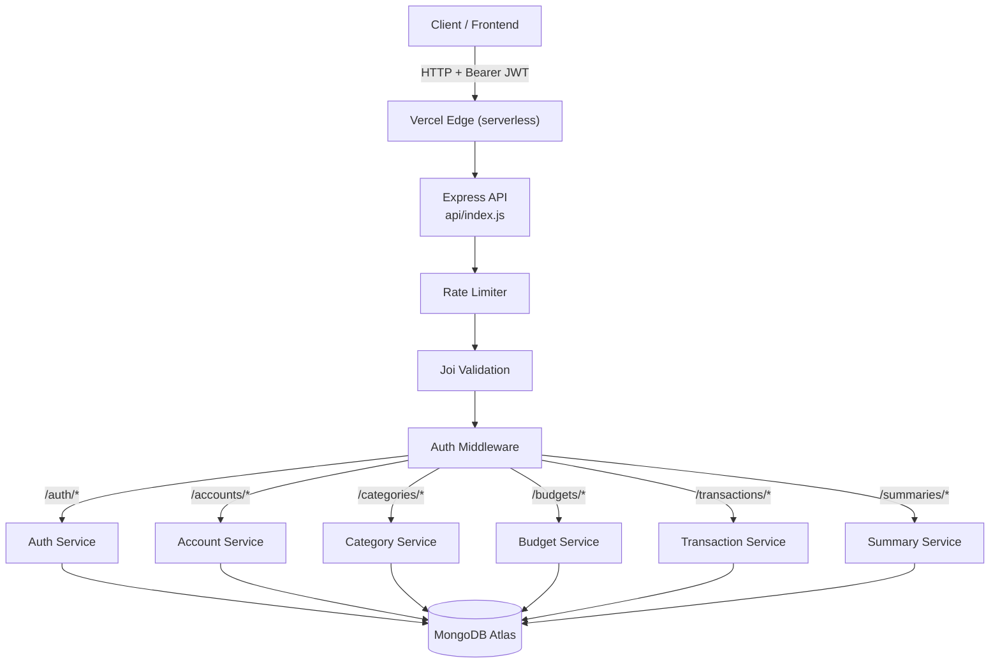
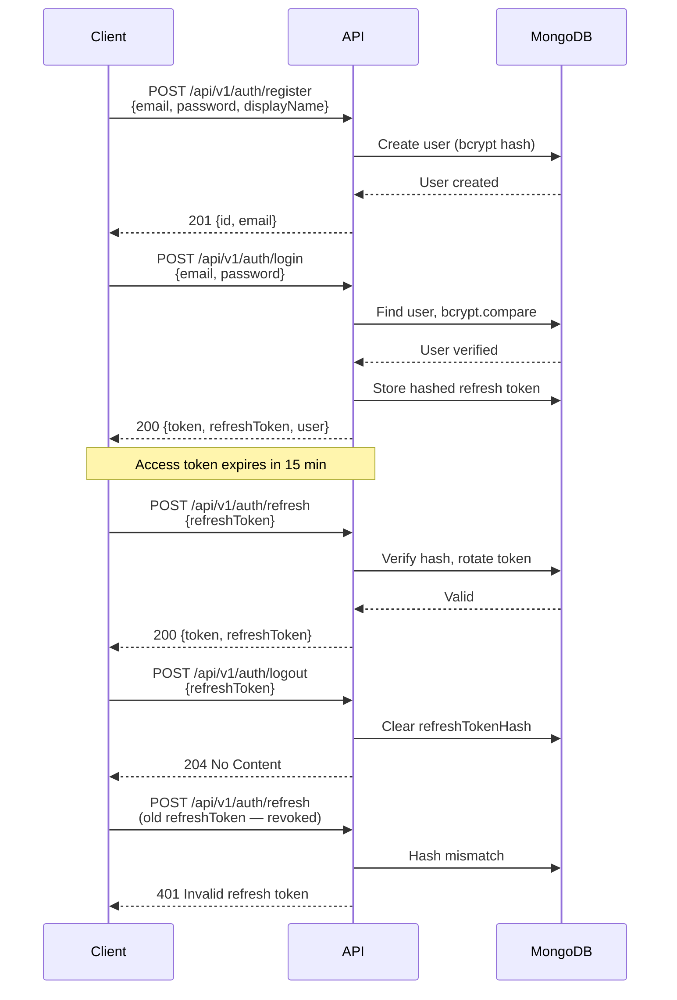
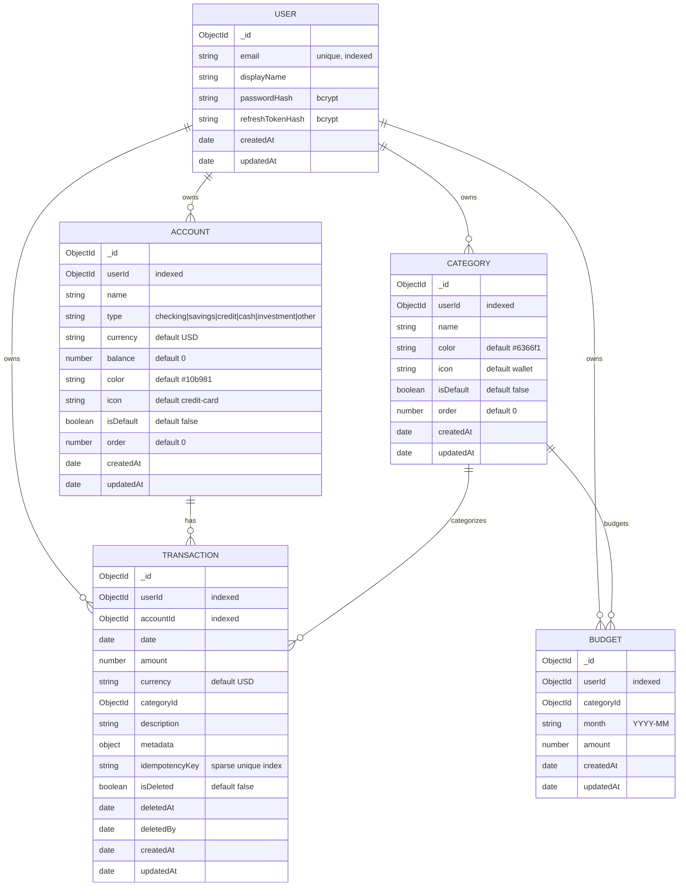
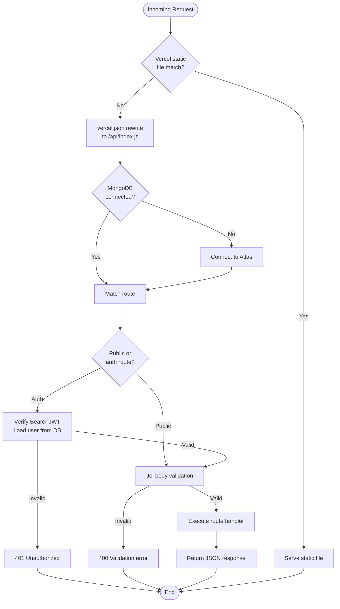

# Personal Budget API

A Node.js/Express/MongoDB REST API for personal budget tracking. Supports user authentication (JWT + refresh tokens), budget management, transaction recording with idempotency, and monthly summaries with category breakdowns.

---

## Features

- **Authentication** — Register, login, JWT access tokens (15 min), refresh tokens with rotation, logout
- **Accounts** — Create, list, get, update, delete accounts (checking, savings, credit, cash, investment, other) with server-generated IDs
- **Categories** — Create, list, get, update, delete categories with server-generated IDs
- **Budgets** — Create/update (upsert), list, delete monthly budgets per category
- **Transactions** — Create, list, soft-delete with idempotency keys to prevent duplicates
- **Summaries** — Monthly totals and per-category breakdown with budget progress
- **Rate limiting** — Auth endpoints: 10 req/min; resource endpoints: 100 req/15 min
- **Input validation** — Joi schemas on all write endpoints
- **Security** — Bcrypt password hashing, hashed refresh tokens, query-object injection defense, no raw error leakage in production
- **Referential integrity** — Prevents deletion of accounts/categories in use by transactions or budgets

---

## Architecture



---

## Authentication Flow



### Token Structure

| Token | Lifetime | Storage | Used For |
|-------|----------|---------|----------|
| Access Token (JWT) | 15 minutes | Client memory / header | Authenticating API requests |
| Refresh Token | Until logout | Client secure storage | Obtaining new access tokens |

Refresh tokens are stored as **bcrypt hashes** in the User document — never in plaintext. On refresh, the old hash is invalidated and a new one is issued (token rotation).

---

## API Endpoints

All endpoints are prefixed with `/api/v1`.

### Auth

| Method | Endpoint | Auth | Body | Success | Description |
|--------|----------|------|------|---------|-------------|
| `POST` | `/auth/register` | No | `{email, password, displayName?}` | 201 `{id, email}` | Create new user |
| `POST` | `/auth/login` | No | `{email, password}` | 200 `{token, refreshToken, user}` | Obtain JWT + refresh token |
| `POST` | `/auth/refresh` | No | `{refreshToken}` | 200 `{token, refreshToken}` | Rotate access token |
| `POST` | `/auth/logout` | No | `{refreshToken}` | 204 | Revoke refresh token |

### Accounts

All accounts have server-generated `_id` (MongoDB ObjectId). Client does **not** provide an ID on creation.

| Method | Endpoint | Auth | Body | Success | Description |
|--------|----------|------|------|---------|-------------|
| `POST` | `/accounts` | Yes | `{name, type, currency?, balance?, color?, icon?, isDefault?, order?}` | 201 account | Create account |
| `GET` | `/accounts` | Yes | — | 200 `[account, ...]` | List all accounts for user |
| `GET` | `/accounts/:id` | Yes | — | 200 account | Get single account |
| `PATCH` | `/accounts/:id` | Yes | `{name?, type?, currency?, balance?, color?, icon?, isDefault?, order?}` | 200 account | Update account |
| `DELETE` | `/accounts/:id` | Yes | — | 204 / 409 | Delete account (409 if in use by transactions) |

**Account types:** `checking`, `savings`, `credit`, `cash`, `investment`, `other`

### Categories

All categories have server-generated `_id` (MongoDB ObjectId). Client does **not** provide an ID on creation.

| Method | Endpoint | Auth | Body | Success | Description |
|--------|----------|------|------|---------|-------------|
| `POST` | `/categories` | Yes | `{name, color?, icon?, isDefault?, order?}` | 201 category | Create category |
| `GET` | `/categories` | Yes | — | 200 `[category, ...]` | List all categories for user |
| `GET` | `/categories/:id` | Yes | — | 200 category | Get single category |
| `PATCH` | `/categories/:id` | Yes | `{name?, color?, icon?, isDefault?, order?}` | 200 category | Update category |
| `DELETE` | `/categories/:id` | Yes | — | 204 / 409 | Delete category (409 if in use by budgets or transactions) |

### Budgets

| Method | Endpoint | Auth | Body | Success | Description |
|--------|----------|------|------|---------|-------------|
| `POST` | `/budgets` | Yes | `{categoryId, month, amount}` | 201 budget | Create or update budget (upsert) |
| `GET` | `/budgets` | Yes | — | 200 `[budget, ...]` | List all budgets for user |
| `DELETE` | `/budgets/:id` | Yes | — | 204 | Delete a budget |

### Transactions

| Method | Endpoint | Auth | Body | Success | Description |
|--------|----------|------|------|---------|-------------|
| `POST` | `/transactions` | Yes | `{accountId, date, amount, categoryId?, description?, idempotencyKey?}` | 201 transaction | Create transaction |
| `GET` | `/transactions` | Yes | `?from=&to=` | 200 `[tx, ...]` | List non-deleted transactions |
| `DELETE` | `/transactions/:id` | Yes | — | 204 | Soft-delete transaction |

### Summaries

| Method | Endpoint | Auth | Query | Success | Description |
|--------|----------|------|-------|---------|-------------|
| `GET` | `/summaries/monthly` | Yes | `?year=&month=` | 200 `{totals, byCategory, budgets}` | Monthly spending summary |

---

## Data Model



### Budget Upsert Logic

When you `POST /budgets` with the same `userId` + `categoryId` + `month` combination, the existing budget is **updated** rather than duplicated. The service uses `findOneAndUpdate` with `upsert: true`, so the same endpoint handles both create and update.

### Transaction Idempotency

Include an `idempotencyKey` in the transaction body. If a transaction with the same `userId` + `idempotencyKey` already exists, the existing transaction is returned instead of creating a duplicate. This is enforced by a unique partial index on `{userId, idempotencyKey}`.

### Soft Deletes

Transactions are never hard-deleted. `DELETE /transactions/:id` sets `isDeleted: true`, `deletedAt`, and `deletedBy`. Listing transactions (`GET`) only returns `isDeleted: false` records.

---

## Request Flow



---

## Installation

### Prerequisites

- Node.js >= 20.x
- MongoDB (local or Atlas)
- npm or yarn

### Setup

```bash
# Clone the repository
git clone https://github.com/Colin-Stark/personal_budget.git
cd personal_budget

# Install dependencies
npm ci

# Copy environment template
cp .env.example .env   # or create .env manually

# Add required environment variables (see below)
```

### Environment Variables

Create a `.env` file in the project root:

```env
# MongoDB connection string
MONGO_URI=mongodb+srv://<user>:<password>@<cluster>.mongodb.net/<db>?retryWrites=true&w=majority

# JWT signing secret (use a long random string)
JWT_SECRET=<your-secret-key-here>

# Server port (optional, defaults to 3000)
PORT=3000
```

> **Never commit `.env` to version control.** The file is gitignored.

---

## Running Locally

```bash
# Development (with nodemon auto-reload)
npm run dev

# Production
npm start
```

The server starts on `http://localhost:3000` by default.

---

## Running Tests

```bash
# Full test suite (unit + integration, requires MongoDB)
npm test

# Unit tests only (no MongoDB needed)
npm run test:unit

# Integration tests only (requires MongoDB)
npm run test:integration
```

Tests require a running MongoDB instance. For local development with MongoDB Compass or a local mongod, set the connection string in `.env`.

---

## Project Structure

```
personal_budget/
├── api/
│   └── index.js          # Vercel serverless entry point
├── src/
│   ├── middleware/
│   │   ├── auth.js       # JWT verification middleware
│   │   ├── errorHandler.js
│   │   ├── rateLimit.js  # Express rate limiter config
│   │   └── validation.js # Joi body validation middleware
│   ├── models/
│   │   ├── account.js    # Account schema + indexes
│   │   ├── budget.js     # Budget schema + indexes
│   │   ├── category.js   # Category schema + indexes
│   │   ├── transaction.js # Transaction schema + indexes
│   │   └── user.js       # User schema + indexes
│   ├── routes/
│   │   ├── accounts.js   # Account CRUD
│   │   ├── auth.js       # Register, login, refresh, logout
│   │   ├── budgets.js    # Budget CRUD
│   │   ├── categories.js # Category CRUD
│   │   ├── summaries.js  # Monthly summary endpoint
│   │   └── transactions.js # Transaction CRUD
│   ├── services/
│   │   ├── accountService.js    # Account business logic
│   │   ├── authService.js       # Auth business logic
│   │   ├── budgetService.js     # Budget business logic
│   │   ├── categoryService.js   # Category business logic
│   │   ├── summaryService.js    # Aggregation logic
│   │   └── transactionService.js # Transaction business logic
│   └── lib/
│       └── logger.js     # Winston logger
├── tests/
│   ├── helpers/
│   │   └── mongo.js      # Test DB connect/disconnect
│   ├── setupEnv.js       # Loads JWT_SECRET + MONGO_URI for tests
│   ├── unit/
│   │   └── services/     # Unit tests for services
│   ├── integration/
│   │   ├── accounts.test.js
│   │   ├── auth.test.js
│   │   ├── budgets.test.js
│   │   ├── categories.test.js
│   │   ├── summaries.test.js
│   │   └── transactions.test.js
│   └── contract/
│       └── *.test.js     # OpenAPI contract validation
├── .github/
│   └── workflows/
│       ├── ci.yml        # Lint, test, gitleaks scan
│       └── codeql-analysis.yml # Security scanning
├── server.js             # Local server entry point
├── vercel.json           # Vercel routing config
├── package.json
├── jest.config.cjs
└── .eslintrc.json
```

---

## Deployment

### Vercel

This project is configured for deployment on Vercel using serverless functions.

```bash
# Install Vercel CLI
npm i -g vercel

# Deploy
vercel --prod
```

Vercel environment variables must be set in the dashboard:
- `MONGO_URI` — your MongoDB Atlas connection string
- `JWT_SECRET` — your JWT signing secret

The `api/index.js` file is the serverless entry point. It wraps the Express app with lazy MongoDB connection handling for Vercel's cold-start model.

### CI/CD

GitHub Actions runs on every pull request to `main`:
1. **Lint** — ESLint with Jest and Prettier configs
2. **MongoDB connectivity check** — fails fast with clear error if Atlas is unreachable
3. **Tests** — Full Jest suite (unit + integration)
4. **Security scan** — gitleaks for leaked secrets
5. **CodeQL** — GitHub's semantic code analysis

---

## Tech Stack

| Layer | Technology |
|-------|-----------|
| Runtime | Node.js 20+ |
| Framework | Express 5 |
| Database | MongoDB (Mongoose ODM) |
| Auth | JWT (jsonwebtoken) + bcrypt |
| Validation | Joi |
| Rate Limiting | express-rate-limit |
| Logging | Winston |
| Testing | Jest + Supertest |
| Deployment | Vercel (serverless) |
| CI | GitHub Actions |
